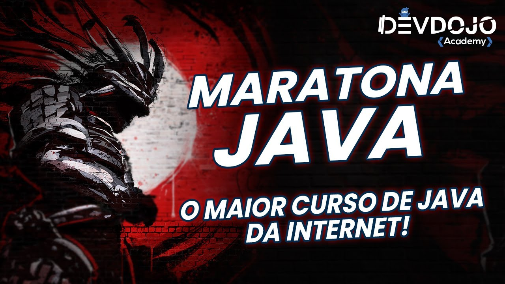

## Maratona Java: Virado no Jiraya

Este repositório tem o objetivo de manter todos os arquivos produzidos dentro do curso **[Maratona Java: Virado no Jiraya](https://www.youtube.com/playlist?list=PL62G310vn6nFIsOCC0H-C2infYgwm8SWW)**, do canal **[DevDojo Academy](https://www.youtube.com/@DevDojoBrasil)**, ministrado por **[William Suane](https://www.linkedin.com/in/williamsuane/)**. 

O objetivo de estudar a linguagem Java é fortalecer o aprendizado tanto da sintaxe quanto dos conceitos e das diversas maneiras de resolver problemas, para servir de base ao aprendizado mais simplificado da linguagem **[Apex](https://developer.salesforce.com/docs/atlas.en-us.apexcode.meta/apexcode/apex_dev_guide.htm)**, que é baseada em Java e proprietária, utilizada na plataforma **[Salesforce](https://www.salesforce.com/br/)**. 

Todos os direitos do conteúdo do curso são reservados à DevDojo Academy.

---

## 📚 Conteúdo contemplado:
Esta parte do conteúdo foi estudada tanto por aprimorar o conhecimento na linguagem Java e nos conceitos de POO, como por servir com base no aprendizado da linguagem Apex, do Salesforce):  

* [ Aula 001 a 007 ] - Ementa do curso + Configuração do ambiente 
* [ Aula 008 a 038 ] - Java Básico 
* [ Aula 039 a 094 ] - Orientação a Objetos 
* [ Aula 095 a 105 ] - Exceções 
* [ Aula 106 a 136 ] - Classes Utilitárias 
* [ Aula 159 e 160 ] - Serialization 
* [ Aula 161 a 182 ] - Coleções 
* [ Aula 183 a 188 ] - Generics 
* [ Aula 189 a 192 ] - Classes Internas
* [ Aula 193 a 200 ] - Parametrização, Lambdas e Method Reference
* [ Aula 246 a 251 ] - Padrões de Projeto 
* [ Aula 255 e 258 ] - Dependências
* [ Aula 280 e 281 ] - Testes Unitários (JUnit) 

---

## 📅 Conteúdo NÃO contemplado 
Esta parte do conteúdo não foi estudada por não exercer influência direta no aprendizado da linguagem Apex, do Salesforce):

* [ Aula 137 a 158 ] - IO/NIO 
* [ Aula 201 e 202 ] - Optional 
* [ Aula 203 a 245 ] - Streams, Threads e Concorrência
* [ Aula 252 a 279 ] - JDBC 
* [ Aula 282 a 285 ] - Atualizações (Java 16)

---
